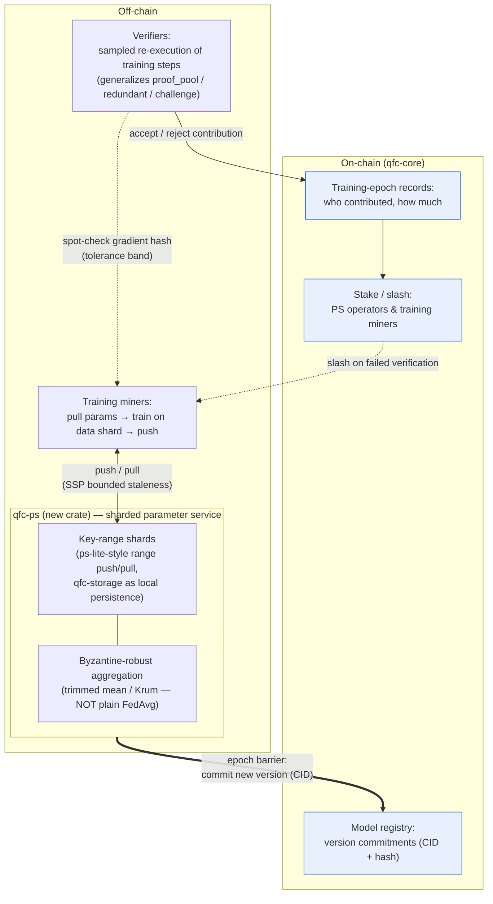
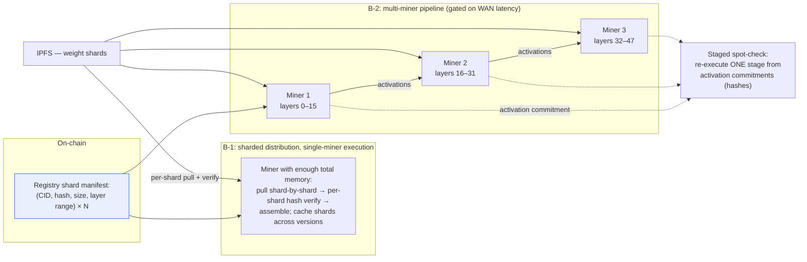

# QFC AI v3 Roadmap — Decentralized Training (Parameter Server) & Sharded Inference

*🌐 [中文](ROADMAP-AI-V3.zh.md)*

**Status:** in progress — B-1 shipped, Feature A core (A0–A6) shipped, B-2 gating spike done. Remaining work (B-2 build, Feature A node integration) is gated on live multi-region / testnet infrastructure, not pure-library code. See [Progress](#progress).
**Owner:** Larry. **Created:** 2026-06-10. **Last updated:** 2026-06-14.

## Where v2.x leaves us

The pieces this roadmap builds on, all live today:

- `qfc-inference` — multi-backend inference runtime (CPU / CUDA / Metal / ROCm / OpenCL via candle + ONNX Runtime); governance-approved frozen models (BERT, Qwen2, Whisper) downloaded from HuggingFace, CID-addressed via IPFS.
- `qfc-ai-coordinator` — task pool, capability-based miner assignment (`assignment.rs`: backend, `GpuTier`, `memory_mb`, models), ~5% spot-check re-execution verification (`verification.rs`, `redundant.rs`, `challenge.rs`), governance model registry (`registry.rs`), treasury.
- `qfc-storage` — RocksDB engine (18 CFs, atomic `WriteBatch`, BE-ordered keys) — the persistence layer any new component reuses.
- Consensus integration — `WorkProof { flops_estimated, … }` per epoch, `inference_score` on validators.

**The two v3 features below share one principle: the chain stores *commitments and incentives*; heavy ML data flows off-chain.** A parameter server's relaxed consistency can never sit on the consensus path (state must be deterministically re-derivable), so every design here keeps PS-shaped components strictly off-chain with on-chain anchoring.

---

## Progress

_Updated 2026-06-14. Every milestone shipped via the same flow — dedicated git worktree → implement → adversarial review → fix → PR; each review caught and fixed real issues (poisoning, sampling-grind, free-jail griefing, integer overflow, aggregation-unit mismatch) before merge._

### Shipped

| Milestone | PR | What landed |
|---|---|---|
| **B-1** (B0–B2) | [#102](https://github.com/qfc-network/qfc-core/pull/102) | ADR-0001; registry shard manifest; per-shard-verified resumable IPFS download; cross-version shard cache reuse |
| **A0** | [#107](https://github.com/qfc-network/qfc-core/pull/107) | ADRs 0002–0008 (**7**, not 5 — review added data-availability + verification-economics) |
| **A1 + A2** | [#107](https://github.com/qfc-network/qfc-core/pull/107) | `qfc-ps` crate: range-sharded `ShardStore`, SSP `SspClock`, `ShardService`; coordinate-wise trimmed-mean aggregation + seeded poisoning property tests |
| **A3** | [#110](https://github.com/qfc-network/qfc-core/pull/110) | training-job type + deterministic epoch assignment in `qfc-ai-coordinator`; per-worker gradient accumulation (n = workers, not rows) |
| **A4** | [#114](https://github.com/qfc-network/qfc-core/pull/114) | sampled training-step re-execution; grind-proof sampling (entropy = committed `params_hash`); exact + per-coordinate tolerance-band compare |
| **A5** | [#120](https://github.com/qfc-network/qfc-core/pull/120) | ADR-0009; deterministic `settle_epoch` → version commitment + pro-rata rewards + slashing; `TrainingChainStore`; `SlashableOffense::InvalidTraining` |
| **A6** | [#122](https://github.com/qfc-network/qfc-core/pull/122) | ADR-0010; `qfc-training-pilot` — in-process ≥3-miner end-to-end pilot over the real A1–A5 APIs (deterministic CPU model, cheater caught + slashed, loss 5.67→0.11) |
| **B-2 spike** | [#124](https://github.com/qfc-network/qfc-core/pull/124) | ADR-0011; real WAN measurements + reproducible calculator (`cargo run -p qfc-inference --example pipeline_latency`); B-2 go/no-go |

### Not started — gated on live infrastructure (not pure-library work)

- **B-2 build (B3–B5).** The spike verdict ([ADR-0011](adr/0011-b2-pipeline-scope.md)): interactive inference over WAN is a **no-go** (RTT-dominated — a 7B model split 4 ways needs ~37 s of network alone for 100 tokens intercontinentally); batch is viable but **bandwidth-gated, not just RTT-gated** (a 7B prefill hop is ~12 s at the measured 20 Mbit/s). B-2 is re-scoped to **batch-only** with bandwidth/locality-aware assignment + activation compression. **Hard gate before building:** re-run the calculator against real cross-region *miner-to-miner* measurements — needs ≥2 miners in different regions (the single-region testnet can't produce them).
- **Feature A node integration.** A6 proves the loop in-process; landing it on a live network needs `qfc-node`/`qfc-consensus`/`qfc-state`/`qfc-network` changes + a real testnet: applying `settle_epoch` output to chain state (balance credit + an absolute-amount slash entry point), P2P broadcast, N-of-M operator agreement on the canonical outcome + penalty set, VRF sampling entropy, per-job stake-locking enforcement, signed `ParamUpdate`. All grep-able as `A6` / `live` / `node` markers in the code; the pilot is their executable spec.
- **Live multi-region testnet pilot** (A6's literal "≥3 miners on testnet" form) and **candle / BERT-class GPU models + A4b GPU tolerance-band verification** — external infra plus the GPU-determinism problem A4 deliberately deferred.

---

## Feature A — Decentralized training via an off-chain Parameter Server

### Why

v2.x miners contribute *inference* (frozen weights). The natural next step is contributing *training*: miners compute gradient updates on assigned data shards, and the network aggregates them into new model versions. That requires exactly a parameter server — a sharded KV holding mutable model parameters, aggregating updates from **untrusted** workers. This is the federated-learning × blockchain space; QFC's existing verification machinery is the differentiator.

### Architecture sketch

```
            ┌── on-chain (qfc-core) ─────────────────────────────┐
            │ model registry: version commitments (CID + hash)   │
            │ training-epoch records: who contributed, how much  │
            │ stake / slash for PS operators & training miners   │
            └────────────────▲───────────────────────────────────┘
                             │ version commit / reward / slash
┌── off-chain ───────────────┴───────────────────────────────────┐
│ qfc-ps (new crate): sharded parameter service                  │
│   · key range → shard (ps-lite-style range push/pull)          │
│   · aggregation = byzantine-robust rule (trimmed mean / Krum), │
│     NOT plain averaging — workers are untrusted                │
│   · bounded-staleness async (SSP); epoch barrier at commit     │
│ training miners: pull params → train on data shard → push      │
│ verifiers: spot-check re-execution of sampled training steps   │
│   (generalizes proof_pool / redundant / challenge)             │
└────────────────────────────────────────────────────────────────┘
```

Rendered version of the same architecture:



Key design decisions (each needs an ADR before code):

1. **Who runs PS shards?** Proposal: staked PS operators (a new role, slashable), assigned shards like validators get epochs. Alternative: validators double as PS operators (simpler, couples failure domains).
2. **Aggregation rule.** Plain FedAvg is poisonable. Start with coordinate-wise trimmed mean; evaluate Krum/Bulyan against cost. The rule choice bounds how much a malicious minority can move the model.
3. **Contribution metering.** Reuse `flops_estimated`-style metering; reward per *accepted* (verification-passing) update, not per claimed work.
4. **Verification.** Sampled re-execution: verifier replays a miner's training step from the committed (params, data-shard, seed) tuple and checks the gradient hash. Determinism requires pinned kernels/seeds — hardest open problem (GPU nondeterminism); fallback is tolerance-band comparison.
5. **Sync model.** SSP with a small staleness bound during an epoch; hard barrier + on-chain version commit at epoch end. RPO story mirrors Monolith's: snapshot per epoch, replay the sample stream.

### Milestones (estimates = Claude session hours, not human time)

| # | Milestone | Deliverable | Est. (Claude session h) | Status |
|---|---|---|---|---|
| A0 | ADRs for decisions 1–5 | `docs/adr/` (shipped as **7** ADRs, 0002–0008) | 2–3 h | ✅ [#107](https://github.com/qfc-network/qfc-core/pull/107) |
| A1 | `qfc-ps` crate skeleton | range-sharded KV, push/pull API, ps-lite-style timestamps; reuses `qfc-storage` as the shard's local persistence | 4–6 h | ✅ [#107](https://github.com/qfc-network/qfc-core/pull/107) |
| A2 | Byzantine-robust aggregation | trimmed-mean aggregator + property tests vs poisoning scenarios | 3–4 h | ✅ [#107](https://github.com/qfc-network/qfc-core/pull/107) |
| A3 | Training task type | extend `qfc-ai-coordinator` task pool + assignment for training jobs (data-shard manifest via IPFS) | 3–4 h | ✅ [#110](https://github.com/qfc-network/qfc-core/pull/110) |
| A4 | Verification path | sampled step re-execution in `verification.rs`; tolerance-band gradient compare | 4–6 h | ✅ [#114](https://github.com/qfc-network/qfc-core/pull/114) |
| A5 | Chain integration | model-version commitments, contribution records, reward/slash hooks in consensus | 4–6 h | ✅ [#120](https://github.com/qfc-network/qfc-core/pull/120) — settlement layer; node-side application gated (see Progress) |
| A6 | Testnet pilot | tiny model (e.g. BERT-class) trained across ≥3 miners on testnet | 3–4 h | ✅ [#122](https://github.com/qfc-network/qfc-core/pull/122) — in-process ≥3-miner pilot; live multi-machine gated |

Wall-clock depends on session spacing; total ≈ **23–33 Claude session hours**. Sequencing: A0 → A1/A2 in parallel → A3 → A4 → A5 → A6. **All A0–A6 shipped** (the in-process realization); live testnet deployment + node integration remain — see [Progress](#progress).

---

## Feature B — Sharded inference for oversized models

### Why

`assignment.rs` already matches tasks to miners by `GpuTier` + `memory_mb`; today a model that fits *no* single miner simply can't be served. Sharding weights lets the network host models larger than any one participant — the chain's version of the serving-PS read path: **pull shard by need, hash-verify each shard**.

### Two stages, deliberately

**B-1: Sharded *distribution*, single-miner *execution*** (cheap, ship first)
- Registry entry becomes a **shard manifest**: list of (shard CID, hash, size, layer range) instead of one CID.
- Miners with enough total memory assemble the model from IPFS shard-by-shard with per-shard verification (today's whole-file hash check generalized) — resumable downloads, partial caching, and shared shard reuse across model versions (most layers don't change between fine-tunes).
- No new execution semantics; pure distribution win.

**B-2: Multi-miner *pipeline execution*** (the hard part — WAN-latency spike done, [ADR-0011](adr/0011-b2-pipeline-scope.md): **interactive over WAN = no-go; batch-only, bandwidth/locality-aware, activation-compressed.** Build gated on real cross-region measurement.)
- Coordinator assigns a **shard group**: an ordered set of miners each holding a layer range; activations flow miner→miner (pipeline parallelism).
- Honest constraint to state up front: pipeline parallelism over WAN latencies is unproven for interactive inference — target batch/async workloads first (the task pool already models async tasks), interactive only if latency data supports it.
- Verification: per-stage activation commitments (hash of layer-boundary tensors) so a spot-check can re-execute *one stage*, not the whole pipeline.
- Failure handling: a dead group member invalidates the assignment → reassign; reward splits per stage, metered like `flops_estimated`.

### Architecture (both stages)



### Milestones (estimates = Claude session hours)

| # | Milestone | Deliverable | Est. (Claude session h) | Status |
|---|---|---|---|---|
| B0 | ADR: shard manifest format + assignment changes | `docs/adr/` (ADR-0001) | 1–2 h | ✅ [#102](https://github.com/qfc-network/qfc-core/pull/102) |
| B1 | Shard manifest in registry + sharded IPFS download with per-shard verify | `registry.rs`, `download.rs` (`shard.rs`) | 3–4 h | ✅ [#102](https://github.com/qfc-network/qfc-core/pull/102) |
| B2 | Assembly + cache reuse across versions | `qfc-inference` data_store | 2–3 h | ✅ [#102](https://github.com/qfc-network/qfc-core/pull/102) |
| — | **WAN-latency spike** (B-2 gate) | real measurements + reproducible calculator + go/no-go | 1 h | ✅ [#124](https://github.com/qfc-network/qfc-core/pull/124) (ADR-0011) |
| B3 | Shard-group assignment | `assignment.rs` extension — now **bandwidth + locality** aware (ADR-0011) | 3–4 h | ⛔ gated on cross-region measurement |
| B4 | Pipeline execution prototype (2 miners, **batch** task) | `qfc-inference` runtime + coordinator router; **activation compression** required (ADR-0011) | 6–8 h | ⛔ gated |
| B5 | Per-stage verification | activation commitments (over **quantized** transported bytes) + staged spot-check | 3–4 h | ⛔ gated |

B-1 (B0–B2) ≈ **6–9 Claude session hours** — **shipped** ([#102](https://github.com/qfc-network/qfc-core/pull/102)). B-2 (B3–B5) ≈ **12–16 h**: the WAN-latency spike is done ([ADR-0011](adr/0011-b2-pipeline-scope.md)) and re-scoped B-2 to batch-only + bandwidth/locality-aware + activation-compressed; **building B3–B5 is gated on re-running the calculator against real cross-region miner-to-miner RTT+bandwidth** (needs ≥2 miners in different regions).

---

## Sequencing & non-goals

- **Recommended order: B-1 → A → B-2.** ✅ **Executed in this order:** B-1 first ([#102](https://github.com/qfc-network/qfc-core/pull/102)), then Feature A core ([#107](https://github.com/qfc-network/qfc-core/pull/107)–[#122](https://github.com/qfc-network/qfc-core/pull/122)), then the B-2 latency spike ([#124](https://github.com/qfc-network/qfc-core/pull/124)). B-1's shard-manifest plumbing was indeed reused by Feature A (snapshot/version distribution, ADR-0007) and is the basis for B-2's compressed-activation transport. B-2 remains gated on latency reality, now quantified.
- **Non-goals, permanently:** PS semantics on the consensus path (determinism is non-negotiable); plain-FedAvg aggregation (poisonable); trusting any single PS operator (always ≥2-of-N verification or staked-slashable operators).
- Estimates above are **Claude session hours** — wall-clock time depends on how sessions are spaced. External dependencies outside Claude's control: testnet miner volunteers for A6/B4, and IPFS gateway capacity for large shard sets.
