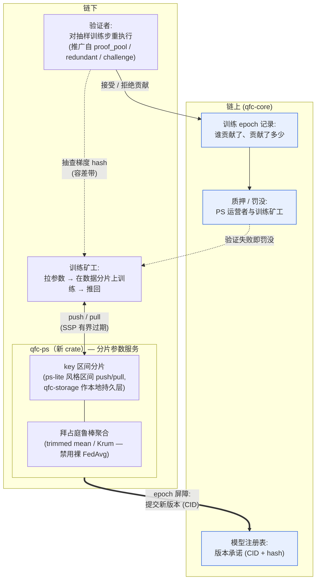
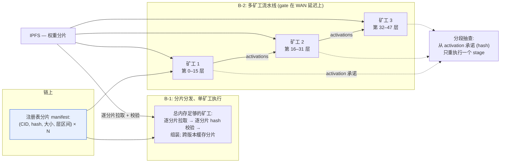

# QFC AI v3 路线图 — 去中心化训练（Parameter Server）与分片推理

*🌐 [English](ROADMAP-AI-V3.md)*

**状态：** 设计路线图，未排期。基于已发布的 v2.x AI 算力栈。
**Owner：** Larry。**创建：** 2026-06-10。

## v2.x 留给我们的基础

本路线图所依托的组件，今天全部在线：

- `qfc-inference` — 多后端推理运行时（candle + ONNX Runtime 支撑 CPU / CUDA / Metal / ROCm / OpenCL）；治理批准的冻结模型（BERT、Qwen2、Whisper），从 HuggingFace 下载、IPFS CID 寻址。
- `qfc-ai-coordinator` — 任务池、按能力分配矿工（`assignment.rs`：backend、`GpuTier`、`memory_mb`、模型列表）、约 5% 抽查重执行验证（`verification.rs`、`redundant.rs`、`challenge.rs`）、治理模型注册表（`registry.rs`）、treasury。
- `qfc-storage` — RocksDB 引擎（18 个 CF、原子 `WriteBatch`、大端有序 key）——任何新组件复用的持久层。
- 共识集成 — 每 epoch 的 `WorkProof { flops_estimated, … }`、validator 上的 `inference_score`。

**下面两个 v3 特性共享一条原则：链上只存*承诺与激励*；繁重的 ML 数据在链下流动。** Parameter server 的松弛一致性永远不能进共识路径（状态必须可确定性重放），因此这里的所有设计都把 PS 形状的组件严格放在链下，用链上锚定。

---

## 特性 A — 通过链下 Parameter Server 实现去中心化训练

### 为什么

v2.x 的矿工贡献的是*推理*（冻结权重）。自然的下一步是贡献*训练*：矿工在分配到的数据分片上计算梯度更新，网络把它们聚合成新的模型版本。这恰恰需要一个 parameter server——持有可变模型参数的分片 KV，聚合来自**不可信** worker 的更新。这是联邦学习 × 区块链的领域；QFC 已有的验证机制是差异化优势。

### 架构草图

```
            ┌── 链上 (qfc-core) ──────────────────────────────────┐
            │ 模型注册表: 版本承诺 (CID + hash)                     │
            │ 训练 epoch 记录: 谁贡献了、贡献了多少                  │
            │ PS 运营者与训练矿工的质押 / 罚没                       │
            └────────────────▲───────────────────────────────────┘
                             │ 版本提交 / 奖励 / 罚没
┌── 链下 ────────────────────┴───────────────────────────────────┐
│ qfc-ps（新 crate）: 分片参数服务                                 │
│   · key 区间 → 分片（ps-lite 风格的区间 push/pull）              │
│   · 聚合 = 拜占庭鲁棒规则（trimmed mean / Krum），               │
│     不是裸平均——worker 不可信                                   │
│   · 有界过期异步（SSP）；提交时 epoch 屏障                       │
│ 训练矿工: 拉参数 → 在数据分片上训练 → 推回                       │
│ 验证者: 对抽样训练步做重执行抽查                                 │
│   （推广自 proof_pool / redundant / challenge）                 │
└────────────────────────────────────────────────────────────────┘
```

同一架构的渲染版：



关键设计决策（动代码前每条都需要一个 ADR）：

1. **谁来运行 PS 分片？** 提议：有质押的 PS 运营者（新角色，可罚没），像 validator 分 epoch 一样分配分片。备选：validator 兼任 PS 运营者（更简单，但耦合故障域）。
2. **聚合规则。** 裸 FedAvg 可被投毒。从坐标级 trimmed mean 起步；按成本评估 Krum/Bulyan。规则选择决定了恶意少数能把模型拉偏多少。
3. **贡献计量。** 复用 `flops_estimated` 风格的计量；按*被接受*（通过验证）的更新付酬，而不是按声称的工作量。
4. **验证。** 抽样重执行：验证者从已承诺的（参数、数据分片、seed）三元组重放矿工的训练步并核对梯度 hash。确定性要求固定 kernel/seed——最难的开放问题（GPU 非确定性）；兜底方案是容差带比较。
5. **同步模型。** epoch 内 SSP 小过期上界；epoch 结束时硬屏障 + 链上版本提交。RPO 故事与 Monolith 同构：每 epoch 快照，重放样本流。

### 里程碑（估算 = Claude session 小时，不是人力时间）

| # | 里程碑 | 交付物 | 估算（Claude session h） |
|---|---|---|---|
| A0 | 决策 1–5 的 ADR | `docs/adr/` ×5 | 2–3 h |
| A1 | `qfc-ps` crate 骨架 | 区间分片 KV、push/pull API、ps-lite 风格 timestamp；复用 `qfc-storage` 作分片本地持久层 | 4–6 h |
| A2 | 拜占庭鲁棒聚合 | trimmed-mean 聚合器 + 针对投毒场景的属性测试 | 3–4 h |
| A3 | 训练任务类型 | 扩展 `qfc-ai-coordinator` 任务池 + 训练作业分配（数据分片 manifest 走 IPFS） | 3–4 h |
| A4 | 验证路径 | `verification.rs` 中的抽样步重执行；容差带梯度比较 | 4–6 h |
| A5 | 链集成 | 模型版本承诺、贡献记录、共识中的奖励/罚没钩子 | 4–6 h |
| A6 | Testnet 试点 | 小模型（如 BERT 级）在 testnet 上跨 ≥3 个矿工训练 | 3–4 h |

墙钟时间取决于 session 间隔；合计约 **23–33 Claude session 小时**。顺序：A0 → A1/A2 并行 → A3 → A4 → A5 → A6。

---

## 特性 B — 超大模型的分片推理

### 为什么

`assignment.rs` 已经按 `GpuTier` + `memory_mb` 给矿工匹配任务；今天一个*任何*单矿工都装不下的模型干脆无法服务。权重分片让网络能承载比任何单个参与者都大的模型——这是 serving-PS 读路径的链上版本：**按需拉分片，逐分片 hash 校验**。

### 刻意分两个阶段

**B-1：分片*分发*、单矿工*执行***（便宜，先发布）
- 注册表条目变成**分片 manifest**：(分片 CID, hash, 大小, 层区间) 的列表，替代单一 CID。
- 总内存足够的矿工从 IPFS 逐分片组装模型并逐分片校验（今天的整文件 hash 检查推广而来）——可断点续传、部分缓存、跨模型版本共享分片复用（fine-tune 之间大多数层不变）。
- 没有新的执行语义；纯分发收益。

**B-2：多矿工*流水线执行***（难的部分，gate 在 B-1 的经验上）
- Coordinator 分配一个**分片组**：一组有序矿工各持一段层区间；activation 在矿工间流动（流水线并行）。
- 预先声明的诚实约束：广域网延迟下的流水线并行对交互式推理未经证明——先做批量/异步负载（任务池本来就建模异步任务），交互式只有在延迟数据支持时才做。
- 验证：每 stage 的 activation 承诺（层边界张量的 hash），让抽查能只重执行*一个 stage* 而不是整条流水线。
- 故障处理：组内成员失联即作废本次分配 → 重新分配；奖励按 stage 拆分，按 `flops_estimated` 风格计量。

### 架构（两个阶段）



### 里程碑（估算 = Claude session 小时）

| # | 里程碑 | 交付物 | 估算（Claude session h） |
|---|---|---|---|
| B0 | ADR：分片 manifest 格式 + assignment 改动 | `docs/adr/` | 1–2 h |
| B1 | 注册表分片 manifest + 逐分片校验的 IPFS 分片下载 | `registry.rs`、`download.rs` | 3–4 h |
| B2 | 组装 + 跨版本缓存复用 | `qfc-inference` data_store | 2–3 h |
| B3 | 分片组分配 | `assignment.rs` 扩展 | 3–4 h |
| B4 | 流水线执行原型（2 矿工，批量任务） | `qfc-inference` runtime + coordinator router | 6–8 h |
| B5 | 每 stage 验证 | activation 承诺 + 分段抽查 | 3–4 h |

B-1（B0–B2）约 **6–9 Claude session 小时**，可独立发布。B-2（B3–B5）约 **12–16 h**，承诺投入前先做一次 WAN 延迟实测 spike。

---

## 顺序与非目标

- **推荐顺序：B-1 → A → B-2。** B-1 小、立刻有用（今天的网络就能上更大的模型），而且铺好了 A5/B-2 都需要的分片 manifest 管线。A 是战略特性。B-2 gate 在延迟现实上。
- **永久非目标：** 共识路径上的 PS 语义（确定性不可妥协）；裸 FedAvg 聚合（可投毒）；信任任何单个 PS 运营者（永远 ≥2-of-N 验证或有质押可罚没的运营者）。
- 上述估算是 **Claude session 小时**——墙钟时间取决于 session 怎么排。Claude 控制之外的外部依赖：A6/B4 的 testnet 矿工志愿者、大分片集的 IPFS 网关容量。
