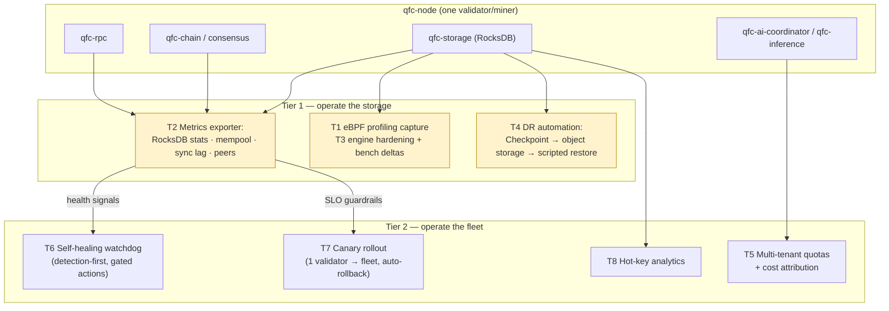

# QFC SRE Roadmap — Observability, DR, Performance & Platform Engineering

*🌐 [中文](ROADMAP-SRE.zh.md)*

**Status:** design roadmap, not scheduled. Companion to [ROADMAP-AI-V3.md](ROADMAP-AI-V3.md) (decentralized training + sharded inference, in implementation).
**Owner:** Larry. **Created:** 2026-06-11.

## Why

QFC already has the *functional* surface of a serious chain (consensus, EVM, AI compute). What it doesn't yet have is the **operational** surface: metrics you can alert on, a rehearsed restore path, engine tuning backed by benchmarks, and safe automation. This roadmap closes that gap — and deliberately exercises the four disciplines of large-scale storage SRE: reliability governance, resource & cost management, platform engineering, and performance engineering.

---

## Tier 1 — operate the storage engine

### T1 — eBPF profiling capture (artifact, not a feature)

Point kernel-level tracing at a running `qfc-node` under write load and **keep the captured traces in-repo**:
- `biolatency`-style block-I/O histograms during compaction; off-CPU flame graph of a write stall; per-thread tail-latency attribution (compaction vs flush vs RPC).
- Deliverable: `docs/profiling/` with the traces, the commands used, and a short findings note (e.g. "p999 spikes correlate with L0→L1 compaction; see flamegraph").
- Why first: cheapest item here, and it produces *evidence* the rest of the roadmap can reference (T3 picks optimization targets from it).

**Estimate: 1–2 Claude session hours.**

### T2 — Node observability exporter

Extend `qfc-node/src/metrics.rs` into a real Prometheus surface:
- **RocksDB**: enable statistics; export compaction-stall counters, pending-compaction bytes, block-cache hit/miss, memtable size, per-CF write/read volume, WAL sync latency.
- **Chain**: block height/lag vs peers, time-since-last-block, reorg count, mempool depth/age, peer count, sync state.
- **RPC**: per-method p50/p99/p999 latency histograms, in-flight requests, error rates.
- Ship `docs/observability/`: a Grafana dashboard JSON + alert rules (multi-window burn-rate on block production and RPC SLOs, plus *backup freshness* once T4 lands).

| Milestone | Deliverable | Est. |
|---|---|---|
| T2.1 RocksDB statistics → exporter | metrics.rs + qfc-storage stats hook | 2 h |
| T2.2 chain/mempool/RPC metrics | metrics.rs, rpc middleware | 1–2 h |
| T2.3 dashboard + alert rules | docs/observability/ | 1 h |

**Estimate: 3–4 Claude session hours.** Note: AI v3's `qfc-ps` will want this exporter too — build it once here.

### T3 — Storage-engine hardening (with before/after numbers)

The known engine gaps, fixed and *measured* (`cargo bench -p qfc-storage` before/after for each):
1. **Wire the block cache + write buffer to the data CFs** — today `set_block_based_table_factory`/`set_write_buffer_size` are set on DB-level `Options` only (`db.rs:61-89`), so the 18 named CFs never see the 512 MB cache.
2. **Bloom filters on point-lookup CFs** (`transactions`, `receipts`, `state`, `code`, indexes) + `cache_index_and_filter_blocks`.
3. **Crash-atomic block commit** — fold receipts, head metadata (`latest_block_number`/`latest_state_root`), and `eth_tx_index` into the same `WriteBatch` as `store_block` (`qfc-chain/src/chain.rs:530-577` vs `:477-499`, `:350`).
4. **Explicit durability policy** — decide `WriteOptions::set_sync` for canonical-block writes; document the RPO either way.
5. Iterator error propagation (no `unwrap()` on a corrupt SST), `contains()` via `key_may_exist_cf`, batch handle caching, `open_temp` leak fix.

| Milestone | Deliverable | Est. |
|---|---|---|
| T3.1 cache/buffer/bloom (items 1–2) | db.rs CF options pass + bench deltas | 1–2 h |
| T3.2 crash-atomic commit + sync policy (3–4) | chain.rs + ADR | 2 h |
| T3.3 robustness items (5) | db.rs/batch.rs + tests | 1–2 h |

**Estimate: 4–6 Claude session hours.**

### T4 — DR automation (the rehearsed restore)

- **RocksDB Checkpoint** integration: periodic hard-link snapshot of a live node (near-instant, consistent); wire `load_latest_checkpoint` (today a stub returning `None`) so consensus state fast-restarts from the latest epoch checkpoint instead of re-deriving.
- Ship snapshots to object storage (S3/MinIO) with retention; export *backup freshness* as a metric (alert on age, not job success).
- **Scripted restore runbook** (`scripts/restore.sh` + `docs/DR.md`): fetch → verify → place → restart → validate against peers. Measure and record RPO (snapshot interval) and RTO (restore wall time) on testnet.
- **Game day**: a repeatable chaos script that kills a node's data dir and times the two recovery paths (local checkpoint vs full peer re-sync).

| Milestone | Deliverable | Est. |
|---|---|---|
| T4.1 Checkpoint + fast restart (de-stub) | qfc-storage/qfc-consensus | 2 h |
| T4.2 object-storage shipping + freshness metric | backup task + T2 hook | 1–2 h |
| T4.3 restore runbook + game-day script, measured RPO/RTO | scripts/ + docs/DR.md | 1–2 h |

**Estimate: 4–6 Claude session hours.**

---

## Tier 2 — operate the fleet

### T5 — Multi-tenant quotas + cost attribution (3–5 h)
Per-submitter quotas on the AI task pool (QPS, GPU-time budget) with fair scheduling; meter `flops_estimated` per task → periodic cost report per tenant and per miner (treasury hook). Degradation order documented: shed lowest-priority tenant first.

### T6 — Self-healing watchdog (3–4 h)
Detect block-production stall, stuck sync, and compaction stall from T2 signals; **detection-first** (alert + health score), automated restart only behind explicit safety gates (max restarts/hour, never during state-mutating operations). Same never-auto-apply philosophy as proven elsewhere — automation earns trust incrementally.

### T7 — Canary rollout for node releases (3–5 h)
Stage a new node version on one testnet validator; promote only after N clean epochs (no missed blocks, SLOs green from T2); auto-rollback on regression. Deliverable: rollout script + policy doc.

### T8 — Hot-key analytics (2–3 h)
Per-CF and per-account access sampling in `qfc-storage`/`qfc-state` → top-N hot accounts/contracts (access is power-law). Feeds cache sizing (T3) and is the chain-side mirror of embedding hot-key skew.

---

## Sequencing & non-goals

- **Order: T1 → T2 → (T3 ∥ T4) → Tier 2.** T1 produces the evidence; T2 is the foundation every later item (and AI v3's `qfc-ps`) reports into; T3/T4 are independent once T2 exists.
- **Totals:** Tier 1 ≈ **12–18 Claude session hours**; Tier 2 ≈ **11–17 h**. Wall-clock depends on session spacing.
- **Coordination with AI v3:** the observability exporter (T2) and DR machinery (T4) are shared infrastructure — the AI v3 implementation session should consume them, not rebuild them. Storage files (`db.rs`, `chain.rs`) are touched by T3 — coordinate branches if AI work lands in the same files.
- **Non-goals:** auto-remediation without gates (T6 stays detection-first until trust is earned); benchmarking theater (every T3 change ships with its before/after numbers or it doesn't ship); duplicating AI v3 scope here.
