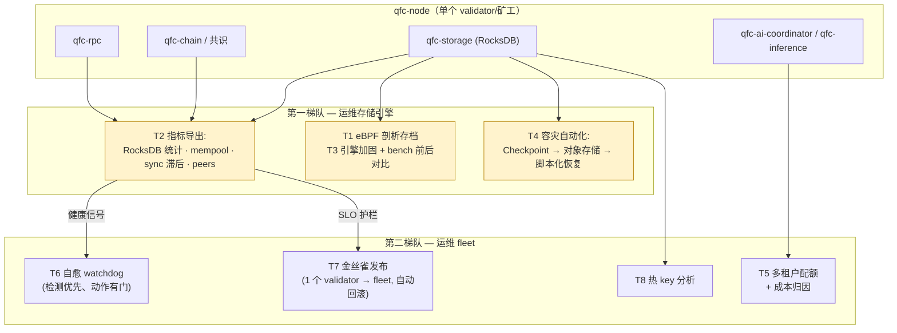

# QFC SRE 路线图 — 可观测性、容灾、性能与平台工程

*🌐 [English](ROADMAP-SRE.md)*

**状态：** 设计路线图，未排期。与 [ROADMAP-AI-V3.zh.md](ROADMAP-AI-V3.zh.md)（去中心化训练 + 分片推理，实现中）配套。
**Owner：** Larry。**创建：** 2026-06-11。

## 为什么

QFC 已经有了一条正经链的*功能*面（共识、EVM、AI 算力），还缺的是**运维**面：可告警的指标、演练过的恢复路径、有基准数据支撑的引擎调优、以及安全的自动化。本路线图补齐这一块——并刻意演练大规模存储 SRE 的四项纪律：可靠性治理、资源与成本管理、平台工程、性能工程。

---

## 第一梯队 — 运维存储引擎

### T1 — eBPF 剖析存档（artifact，不是功能）

把内核级追踪指向写入负载下运行的 `qfc-node`，并**把抓到的 trace 留在仓库里**：
- compaction 期间的 `biolatency` 风格块 I/O 直方图；一次 write stall 的 off-CPU 火焰图；按线程的尾延迟归因（compaction vs flush vs RPC）。
- 交付物：`docs/profiling/`——trace 文件、所用命令、一页发现笔记（例如"p999 尖刺与 L0→L1 compaction 相关，见火焰图"）。
- 为什么排第一：本清单里最便宜的一项，而且产出*证据*供后续引用（T3 的优化目标从这里选）。

**估算：1–2 Claude session 小时。**

### T2 — 节点可观测性导出

把 `qfc-node/src/metrics.rs` 扩成真正的 Prometheus 面：
- **RocksDB**：打开 statistics；导出 compaction stall 计数、pending-compaction 字节、block cache 命中/未命中、memtable 大小、按 CF 的读写量、WAL sync 延迟。
- **链**：区块高度/相对 peers 的滞后、距上一个块的时间、reorg 计数、mempool 深度/年龄、peer 数、sync 状态。
- **RPC**：按方法的 p50/p99/p999 延迟直方图、在途请求数、错误率。
- 交付 `docs/observability/`：Grafana 面板 JSON + 告警规则（出块与 RPC SLO 的多窗口 burn-rate，T4 落地后再加*备份新鲜度*）。

| 里程碑 | 交付物 | 估算 |
|---|---|---|
| T2.1 RocksDB statistics → 导出 | metrics.rs + qfc-storage 统计钩子 | 2 h |
| T2.2 链/mempool/RPC 指标 | metrics.rs、rpc 中间件 | 1–2 h |
| T2.3 面板 + 告警规则 | docs/observability/ | 1 h |

**估算：3–4 Claude session 小时。** 注：AI v3 的 `qfc-ps` 也需要这个导出器——在这里建一次。

### T3 — 存储引擎加固（带前后对比数字）

已知的引擎缺口，修掉并*测量*（每项都跑 `cargo bench -p qfc-storage` 前后对比）：
1. **把 block cache + write buffer 接到数据 CF 上**——今天 `set_block_based_table_factory`/`set_write_buffer_size` 只设在 DB 级 `Options` 上（`db.rs:61-89`），18 个具名 CF 从未见过那 512 MB cache。
2. **点查 CF 加 bloom filter**（`transactions`、`receipts`、`state`、`code`、各索引）+ `cache_index_and_filter_blocks`。
3. **区块提交崩溃原子化**——把 receipts、head 元数据（`latest_block_number`/`latest_state_root`）和 `eth_tx_index` 并进 `store_block` 的同一个 `WriteBatch`（`qfc-chain/src/chain.rs:530-577` vs `:477-499`、`:350`）。
4. **显式持久性策略**——为规范区块写入决定 `WriteOptions::set_sync`；无论选哪边都把 RPO 写下来。
5. 迭代器错误传播（坏 SST 不再 `unwrap()`）、`contains()` 走 `key_may_exist_cf`、batch 的 handle 缓存、`open_temp` 泄漏修复。

| 里程碑 | 交付物 | 估算 |
|---|---|---|
| T3.1 cache/buffer/bloom（第 1–2 项） | db.rs CF options 一次遍历 + bench 对比 | 1–2 h |
| T3.2 崩溃原子提交 + sync 策略（3–4） | chain.rs + ADR | 2 h |
| T3.3 健壮性项（5） | db.rs/batch.rs + 测试 | 1–2 h |

**估算：4–6 Claude session 小时。**

### T4 — 容灾自动化（演练过的恢复）

- **RocksDB Checkpoint** 集成：对运行中节点做周期性硬链接快照（近乎瞬时、一致）；接通 `load_latest_checkpoint`（今天是返回 `None` 的 stub），让共识状态从最近的 epoch checkpoint 快速重启，而不是重新推导。
- 快照运到对象存储（S3/MinIO）并做保留策略；把*备份新鲜度*导出为指标（按年龄告警，不是按任务成功告警）。
- **脚本化恢复 runbook**（`scripts/restore.sh` + `docs/DR.md`）：拉取 → 校验 → 放置 → 重启 → 对 peers 验证。在 testnet 上实测并记录 RPO（快照间隔）和 RTO（恢复墙钟时间）。
- **Game day**：可重复的混沌脚本——干掉一个节点的数据目录，给两条恢复路径计时（本地 checkpoint vs 全量 peer 重同步）。

| 里程碑 | 交付物 | 估算 |
|---|---|---|
| T4.1 Checkpoint + 快速重启（去 stub） | qfc-storage/qfc-consensus | 2 h |
| T4.2 对象存储运送 + 新鲜度指标 | 备份任务 + T2 钩子 | 1–2 h |
| T4.3 恢复 runbook + game-day 脚本、实测 RPO/RTO | scripts/ + docs/DR.md | 1–2 h |

**估算：4–6 Claude session 小时。**

---

## 第二梯队 — 运维 fleet

### T5 — 多租户配额 + 成本归因（3–5 h）
AI 任务池按提交方配额（QPS、GPU 时间预算）+ 公平调度；按任务计量 `flops_estimated` → 按租户、按矿工出周期成本报表（treasury 钩子）。写明降级顺序：先 shed 最低优先级租户。

### T6 — 自愈 watchdog（3–4 h）
用 T2 的信号检测出块停滞、sync 卡死、compaction stall；**检测优先**（告警 + 健康评分），自动重启只在显式安全门之后（每小时最大重启次数、状态变更操作期间绝不动手）。与既有实践相同的 never-auto-apply 哲学——自动化要靠增量赢得信任。

### T7 — 节点版本金丝雀发布（3–5 h）
新版本先上一个 testnet validator；连续 N 个干净 epoch（不丢块、T2 的 SLO 全绿）才推进；回归即自动回滚。交付物：发布脚本 + 策略文档。

### T8 — 热 key 分析（2–3 h）
`qfc-storage`/`qfc-state` 的按 CF、按账户访问采样 → top-N 热门账户/合约（访问天然幂律）。反哺 cache 容量决策（T3），也是 embedding 热 key 倾斜的链上镜像。

---

## 顺序与非目标

- **顺序：T1 → T2 →（T3 ∥ T4）→ 第二梯队。** T1 产出证据；T2 是后面每一项（以及 AI v3 的 `qfc-ps`）都要汇报进去的地基；有了 T2，T3/T4 相互独立。
- **合计：** 第一梯队约 **12–18 Claude session 小时**；第二梯队约 **11–17 h**。墙钟时间取决于 session 怎么排。
- **与 AI v3 的协调：** 可观测性导出（T2）和容灾机制（T4）是公共基础设施——AI v3 的实现 session 应该消费它们，而不是重造。T3 会动存储文件（`db.rs`、`chain.rs`）——如果 AI 的工作落在同样的文件上，先协调分支。
- **非目标：** 无门控的自动修复（T6 在赢得信任前保持检测优先）；基准表演（T3 的每个改动都必须带前后数字，否则不发布）；在这里重复 AI v3 的范围。
